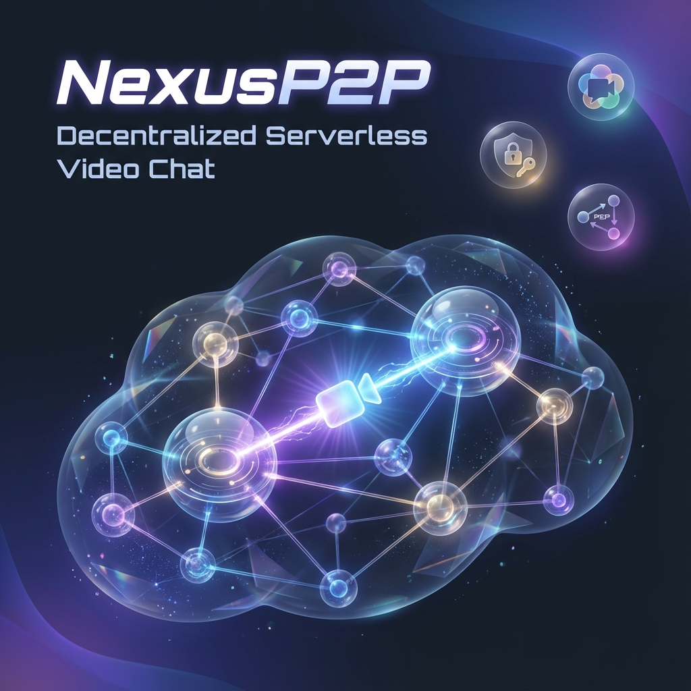

<div align="center">
  
  
  # NexusP2P
  
  ### 🌐 Decentralized Serverless Video Chat
  
  [](LICENSE)
  [](https://react.dev)
  [](https://webrtc.org)
  [](https://vitejs.dev)
  [](https://vercel.com/new)
  
  **Connect instantly with strangers worldwide using secure, serverless Peer-to-Peer technology.**
  
  [Live Demo](https://nexusp2p.vercel.app) · [Report Bug](../../issues) · [Request Feature](../../issues)
  
</div>

---

## ✨ Features

<table>
<tr>
<td width="50%">

### 🔒 **True Privacy**
No servers recording your calls. Your video and audio stream directly to the other person via WebRTC.

### ⚡ **Serverless Architecture**  
No account needed. No login. No database. Pure browser-to-browser connection.

### 🌍 **Global Matching**
Connect with random strangers worldwide instantly using decentralized MQTT signaling.

</td>
<td width="50%">

### 💬 **Real-time Chat**
Send text messages alongside video calls through PeerJS data channels.

### 🎛️ **Full Controls**
Toggle camera, microphone, and remote audio. See connection latency in real-time.

### 📱 **Responsive Design**
Beautiful dark-mode UI that works seamlessly on desktop and mobile.

</td>
</tr>
</table>

---

## 🚀 Quick Start

### Prerequisites

- **Node.js** 18+ (with npm)
- Modern browser with WebRTC support (Chrome, Firefox, Safari, Edge)

### Installation

```bash
# Clone the repository
git clone https://github.com/yourusername/nexusp2p.git

# Navigate to project directory
cd nexusp2p

# Install dependencies
npm install

# Start development server
npm run dev
```

Open [http://localhost:3000](http://localhost:3000) in your browser.

---

## 🛠️ Tech Stack

| Technology | Purpose |
|------------|---------|
| **React 19** | UI Framework |
| **TypeScript** | Type Safety |
| **Vite** | Build Tool & Dev Server |
| **WebRTC** | Peer-to-Peer Media Streaming |
| **PeerJS** | WebRTC Abstraction Layer |
| **MQTT** | Decentralized Signaling |
| **Tailwind CSS** | Styling |
| **Lucide React** | Icons |

---

## 🏗️ Architecture

```
┌─────────────────────────────────────────────────────────────┐
│                         Browser A                            │
│  ┌──────────────┐    ┌──────────────┐    ┌──────────────┐   │
│  │  React UI    │◄──►│   PeerJS     │◄──►│   WebRTC     │   │
│  └──────────────┘    └──────────────┘    └──────┬───────┘   │
└─────────────────────────────────────────────────┼───────────┘
                                                  │
                    ┌─────────────────────────────┼───────────┐
                    │     MQTT Broker (HiveMQ)    │           │
                    │    Signaling Only - No Data │           │
                    └─────────────────────────────┼───────────┘
                                                  │
┌─────────────────────────────────────────────────┼───────────┐
│                         Browser B               │           │
│  ┌──────────────┐    ┌──────────────┐    ┌──────┴───────┐   │
│  │  React UI    │◄──►│   PeerJS     │◄──►│   WebRTC     │   │
│  └──────────────┘    └──────────────┘    └──────────────┘   │
└─────────────────────────────────────────────────────────────┘
```

### How It Works

1. **Signaling**: Users broadcast their presence on a public MQTT topic
2. **Matching**: Deterministic matching (higher Peer ID calls lower) prevents race conditions
3. **Connection**: WebRTC establishes direct peer-to-peer media and data channels
4. **Streaming**: Video, audio, and chat flow directly between browsers

---

## ☁️ Deploy to Vercel

Deploy your own instance with one click:

[](https://vercel.com/new/clone?repository-url=https://github.com/yourusername/nexusp2p)

### Manual Deployment

```bash
# Install Vercel CLI
npm i -g vercel

# Deploy
vercel --prod
```

The project includes a `vercel.json` configuration with:
- ✅ Security headers (X-Frame-Options, CSP, etc.)
- ✅ Asset caching for optimal performance
- ✅ SPA routing support
- ✅ Camera/Microphone permissions policy

---

## 📁 Project Structure

```
nexusp2p/
├── App.tsx                 # Main application component
├── index.html              # HTML entry with SEO meta tags
├── index.tsx               # React entry point
├── types.ts                # TypeScript type definitions
├── vite.config.ts          # Vite configuration
├── vercel.json             # Vercel deployment config
├── components/
│   ├── Button.tsx          # Reusable button component
│   ├── ChatBox.tsx         # Text chat interface
│   └── VideoStage.tsx      # Video display component
├── hooks/
│   └── useChatConnection.ts # Core P2P connection logic
└── public/
    ├── favicon.png         # App icon
    ├── og-image.png        # Open Graph image
    ├── og-image-twitter.png # Twitter card image
    └── site.webmanifest    # PWA manifest
```

---

## 🔧 Configuration

### STUN Servers

The app uses Google's public STUN servers for NAT traversal:

```typescript
const PEER_CONFIG = {
  config: {
    iceServers: [
      { urls: 'stun:stun.l.google.com:19302' },
      { urls: 'stun:stun1.l.google.com:19302' },
      // ... more servers
    ]
  }
};
```

### MQTT Broker

Default signaling uses the public HiveMQ broker:

```typescript
const MQTT_BROKER_URL = 'wss://broker.hivemq.com:8000/mqtt';
```

---

## ⚠️ Disclaimer

> **Important:** NexusP2P facilitates direct browser-to-browser connections. Your IP address is visible to connected peers. All interactions are unmoderated. Users must be 18 years or older. By using this application, you agree to treat others with respect.

---

## 🤝 Contributing

Contributions are welcome! Please feel free to submit a Pull Request.

1. Fork the project
2. Create your feature branch (`git checkout -b feature/amazing-feature`)
3. Commit your changes (`git commit -m 'Add amazing feature'`)
4. Push to the branch (`git push origin feature/amazing-feature`)
5. Open a Pull Request

---

## 📄 License

This project is licensed under the MIT License - see the [LICENSE](LICENSE) file for details.

---

## 🙏 Acknowledgments

- [PeerJS](https://peerjs.com/) - WebRTC made simple
- [HiveMQ](https://www.hivemq.com/) - Public MQTT broker
- [Lucide](https://lucide.dev/) - Beautiful icons
- [Tailwind CSS](https://tailwindcss.com/) - Utility-first CSS

---

<div align="center">
  
  **Made with ❤️ for the decentralized web**
  
  ⭐ Star this repo if you find it useful!
  
</div>
